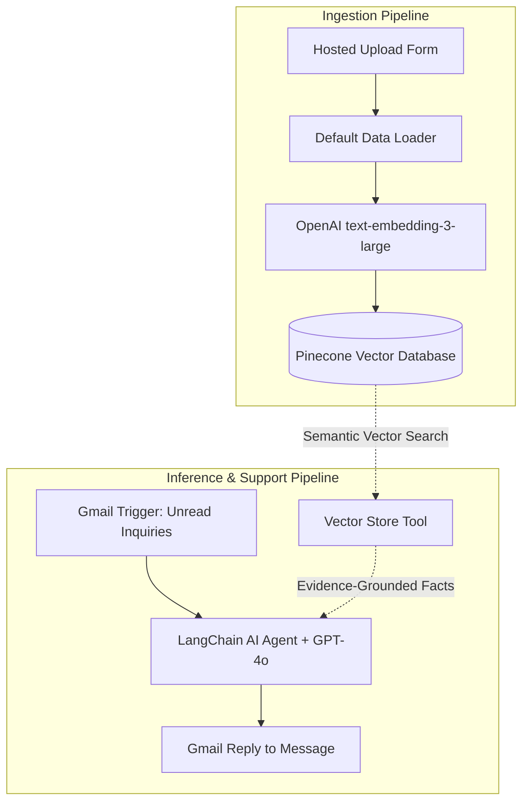

# Architecting an Autonomous RAG Support Agent with n8n, OpenAI GPT-4o, Pinecone, and Gmail

*How to eliminate customer support hallucinations by grounding LangChain agents in dynamic vector databases and native email thread states.*

---

## 1. The Crisis of Generic Customer Support Bots

Customer expectations have radically shifted. When a customer emails a support desk, they expect two things:
1. **Immediate resolution:** Waiting 24 hours for a Tier-1 support agent to lookup a standard return policy is unacceptable in a modern business.
2. **Absolute accuracy:** A hallucinating AI bot that invents non-existent features, discounts, or policies can trigger catastrophic legal and business liabilities.

Standard LLM wrappers fail because their weights are static; they know nothing about your internal product release notes, warranty rules, or updated API documentation. 

To bridge this gap, we engineer an **Autonomous Retrieval-Augmented Generation (RAG) Customer Support Agent** using **n8n**, **OpenAI GPT-4o**, and **Pinecone**.

---

## 2. The Dual-Pipeline Architecture

Rather than monolithic scripts, production-grade RAG systems decouple **Knowledge Ingestion** from **Query Resolution**:



### Why Decoupling Matters:
- **Zero Downtime Updates:** Support teams can upload new product guides or pricing changes at 2:00 PM on a Tuesday, and the support agent instantly possesses that knowledge at 2:01 PM without code deployments, server restarts, or model fine-tuning.
- **Independent Scalability:** Ingestion occurs asynchronously, so uploading a 200-page manual will never block or delay incoming customer emails.

---

## 3. Deep Dive: Knowledge Ingestion & Vector Math

### The Ingestion Stack
1. **`On form submission` (`formTrigger v2.6`):** Provides a clean, hosted webform accepting binary file uploads (`.pdf`, `.txt`, `.docx`).
2. **`Default Data Loader` (`documentDefaultDataLoader v1.1`):** Extracts raw text streams from binary file payloads.
3. **`Embeddings OpenAI` (`embeddingsOpenAi v1.2`):** Powers text vectorization using OpenAI's state-of-the-art `text-embedding-3-large` model.

### Why `text-embedding-3-large` (3072 Dimensions)?
Traditional systems relied on `text-embedding-ada-002` (1536 dimensions). OpenAI's `text-embedding-3-large` produces **3,072-dimensional vector spaces**, offering significantly higher semantic separation:
- Distinguishes nuanced technical differences (e.g., differentiating between "Standard Plan" vs. "Standard Enterprise Add-On").
- Generates precise cosine similarity scores that prevent false-positive document matches.

$$\text{similarity} = \cos(\theta) = \frac{\mathbf{A} \cdot \mathbf{B}}{\|\mathbf{A}\| \|\mathbf{B}\|}$$

4. **`Pinecone Vector Store` (`vectorStorePinecone v1.3`):** Inserts the generated vectors and raw text chunks into the cloud vector index using cosine distance metrics.

---

## 4. The Agentic Reasoning Engine

Most basic automations use static chains (`chainLlm`) that pass every single email into Pinecone regardless of what the user asked.

This workflow uses a true **LangChain Agent** (`@n8n/n8n-nodes-langchain.agent` v3.1) powered by **OpenAI GPT-4o**:

### Autonomous Tool Calling
The Pinecone vector store is attached to the agent as a named tool: `rag_knowledge_base`.

When an incoming email arrives:
- If a user writes: *"Hi, thanks for reaching out!"*, the agent recognizes this as casual conversational etiquette and replies naturally without querying Pinecone.
- If a user asks: *"What is your return policy for damaged hardware after 30 days?"*, the agent recognizes a domain-specific question, automatically formulates a semantic search query, invokes `rag_knowledge_base`, inspects the retrieved document snippets, and synthesizes a grounded response.

### Anti-Hallucination System Prompt
```text
You are a professional, helpful, and empathetic customer support agent.
- Always consult the 'rag_knowledge_base' tool for any customer questions, technical doubts, pricing, or product inquiries.
- Base your answer strictly on the facts retrieved from the knowledge base.
- If the information is not present in the knowledge base, politely inform the user that you will escalate their inquiry to human support.
```

---

## 5. Thread-Aware Gmail Dispatch

A major customer frustration with automated email systems is getting an unthreaded response with a new subject line (`Re: New Email`) that splits the conversation history.

The workflow uses n8n's **Reply to a message** operation:
```javascript
{
  "operation": "reply",
  "messageId": "={{ $('Gmail Trigger').item.json.id }}",
  "emailType": "text",
  "message": "={{ $json.output }}",
  "options": {
    "appendAttribution": false
  }
}
```
By explicitly binding the reply to the incoming email's `messageId`, Gmail attaches the AI response directly into the customer's existing thread. To the customer, it appears as an immediate, attentive reply from a human specialist.

---

## 6. Scaling & Production Hardening

For enterprise deployments handling thousands of inquiries daily:
1. **Document Chunking:** Insert a **Recursive Character Text Splitter** (`textSplitterRecursiveCharacterTextSplitter`) between the Data Loader and Pinecone to chunk documents into 800-character segments with 150-character overlap.
2. **Human-in-the-Loop Escalation:** Add a routing switch after the AI agent. If the response contains an escalation keyword or low similarity score, forward the thread to a Zendesk or Freshdesk ticket queue instead of auto-replying.
3. **Multi-Channel Expansion:** Replicate the agent logic to support Slack, Microsoft Teams, or WhatsApp Business API endpoints using the identical Pinecone vector store.

---

## Conclusion

By grounding OpenAI GPT-4o with Pinecone's vector search inside n8n's visual workflow orchestrator, businesses can deploy customer support agents that combine the empathy and responsiveness of an experienced teammate with the reliability and precision of a database.
