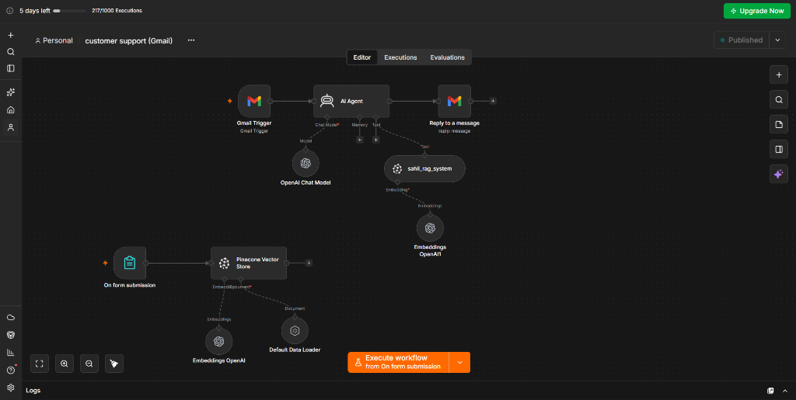
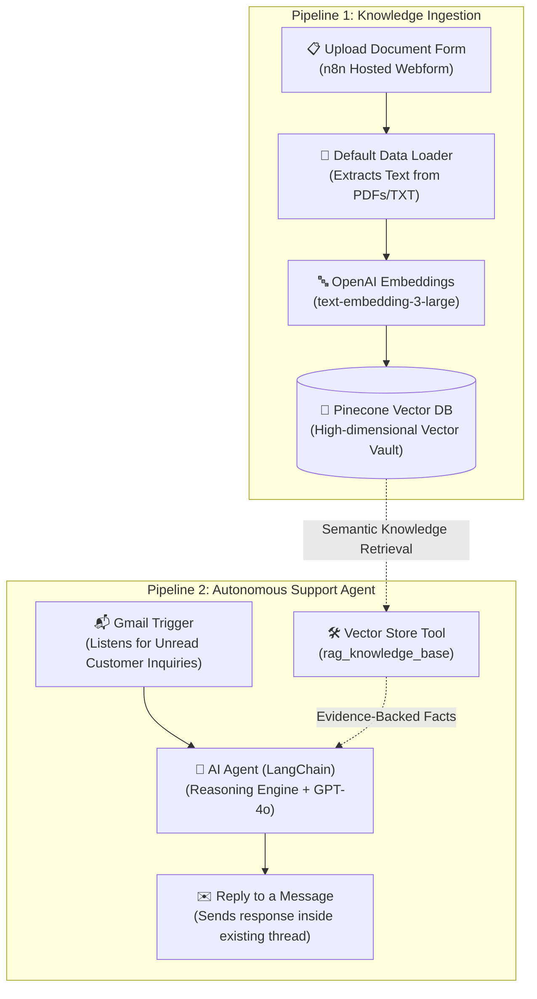

# 🤖 Autonomous AI Customer Support Agent with n8n, Gmail & Pinecone RAG

[](https://n8n.io)
[](https://openai.com/)
[](https://www.pinecone.io/)
[](https://mail.google.com/)
[](#)
[](https://github.com/raj983535/n8n-gmail-rag-support-agent/pulls)

An enterprise-ready **Autonomous AI Customer Support Agent** built entirely in **n8n**. 

It connects an **automated knowledge ingestion pipeline** with an **event-driven email support agent**. You simply upload your company PDFs, manuals, or FAQs via an n8n webform into a **Pinecone Vector Database**. When customers email your support inbox, **OpenAI GPT-4o** retrieves the exact answer from your documents and replies directly inside the active Gmail thread.

---

## 🖼️ Workflow Canvas Preview



---

## 💡 What Does This Do? (In Simple Words)

Imagine having a 24/7 customer support specialist who:
1. **Reads all your company guides:** You upload your product manuals, pricing sheets, or refund policies.
2. **Never forgets a detail:** Stores everything in a secure AI memory vault (Pinecone).
3. **Monitors your support inbox:** The moment a client emails with a question, the agent reads it.
4. **Looks up the answer:** Checks your official uploaded guides instead of guessing or making things up.
5. **Replies in seconds:** Hits "Reply" in the exact same email conversation thread with a polite, professional, and accurate response.

---

## 🚀 How the System Works (Architecture)



---

## 📦 What's Inside

```text
n8n-gmail-rag-support-agent/
├── README.md                                          # Beginner & developer documentation
├── ARTICLE.md                                         # Deep-dive technical engineering article
├── .env.example                                       # Environment configuration template
├── .gitignore                                         # Secret protection & ignore rules
├── workflows/
│   ├── customer-support-rag-complete.json            # Complete 2-in-1 workflow (matches screenshot)
│   ├── 01-knowledge-ingestion-rag.json               # Part 1: Form upload & Pinecone ingestion
│   └── 02-gmail-support-agent.json                   # Part 2: Gmail trigger & GPT-4o RAG agent
└── assets/
    └── workflow-canvas.png                            # High-resolution n8n canvas screenshot
```

---

## 🔑 Easy Credential Setup (Step-by-Step)

### 1. OpenAI API Key
1. Go to [platform.openai.com/api-keys](https://platform.openai.com/api-keys).
2. Click **Create new secret key** and copy it.
3. In n8n, create an **OpenAI API** credential and paste your key.

### 2. Pinecone Vector Database (Free Tier)
1. Sign up at [pinecone.io](https://www.pinecone.io/).
2. Click **Create Index**:
   - **Index Name:** `customer-support-rag`
   - **Dimensions:** `3072` *(Crucial: must be 3072 to match OpenAI `text-embedding-3-large`)*
   - **Metric:** `cosine`
3. Under **API Keys**, copy your key.
4. In n8n, create a **Pinecone API** credential and paste your key.

### 3. Gmail OAuth2 (For Reading & Replying to Emails)
1. Go to Google Cloud Console and enable the **Gmail API**.
2. Create an **OAuth 2.0 Client ID** with Authorized Redirect URI:
   ```text
   https://<your-n8n-domain>/rest/oauth2-credential/callback
   ```
3. In n8n, open the **Gmail Trigger** node, select **Gmail OAuth2**, and authorize your Google account.

---

## 🛠️ Step-by-Step Installation

### 📁 Understanding the Workflow Files (Choose Your Method)

Inside the [`workflows/`](workflows/) folder, you will find 3 JSON files. We provide **two flexible ways** to import and run this system:

| Import Option | File to Use | Best For | Description |
| :--- | :--- | :--- | :--- |
| **Method 1 (Recommended)** | [`workflows/customer-support-rag-complete.json`](workflows/customer-support-rag-complete.json) | **1-Click Setup** | Loads **both pipelines together on one canvas** (exact 1:1 match with the screenshot preview above). Ingestion and Support live side-by-side in one n8n workflow. |
| **Method 2 (Modular)** | [`workflows/01-knowledge-ingestion-rag.json`](workflows/01-knowledge-ingestion-rag.json)<br>+ [`workflows/02-gmail-support-agent.json`](workflows/02-gmail-support-agent.json) | **Team Separation** | Two separate micro-workflows. Use this if you want one workflow for internal team uploads and another dedicated solely to customer support email processing. |

---

### Step 1: Import into n8n
1. Open your n8n workspace.
2. Click **Add Workflow** (`+`) > click the **`...`** menu in the top-right corner.
3. Select **Import from File...**:
   - **For 1-Click Setup:** Choose `workflows/customer-support-rag-complete.json`.
   - *(Alternative)*: If using Method 2, import both `01-knowledge-ingestion-rag.json` and `02-gmail-support-agent.json` as separate workflows.

### Step 2: Link Your Credentials
- Connect your **OpenAI API** credential to `OpenAI Chat Model`, `Embeddings OpenAI`, and `Embeddings OpenAI1`.
- Connect your **Pinecone API** credential to `Pinecone Vector Store` and `rag_knowledge_base`.
- Connect your **Gmail OAuth2** credential to `Gmail Trigger` and `Reply to a message`.

### Step 3: Feed the Knowledge Base
1. Click the **On form submission** node and copy the **Test URL** (or Production URL).
2. Open the URL in your browser.
3. Upload your support FAQ or product document (PDF, TXT, or DOCX).
4. Run the node or submit the form: Pinecone now contains your vectorized knowledge!

### Step 4: Test Customer Support
1. Send an email to your support address asking a specific question answered in your uploaded document.
2. Execute the workflow or wait for the **Gmail Trigger** to poll.
3. Within seconds, check your inbox: the agent will have replied directly inside the thread with an accurate, document-grounded answer!

### Step 5: Publish
- Toggle the workflow switch in the top right to **Active / Published**.
- Your autonomous customer support agent is now working 24/7!

---

## 🛡️ Anti-Hallucination & Safety Guardrails

- **Strict System Prompt:** The agent is instructed to base answers strictly on documents retrieved by the `rag_knowledge_base` tool.
- **Graceful Escalation:** If a customer asks a question outside your documentation, the agent politely states that it does not know and offers to escalate the ticket to a human team member.
- **Thread Continuity:** Uses `messageId: {{ $('Gmail Trigger').item.json.id }}` so customers never get confusing orphaned emails.

---

## 📖 Deep-Dive Article

Looking for an in-depth breakdown of embedding dimensions, vector math, and LangChain tool calling in n8n? Read [ARTICLE.md](ARTICLE.md).

---

## 🤝 Contributing

Contributions, feedback, and feature suggestions are welcome! Feel free to open an issue or submit a Pull Request.
